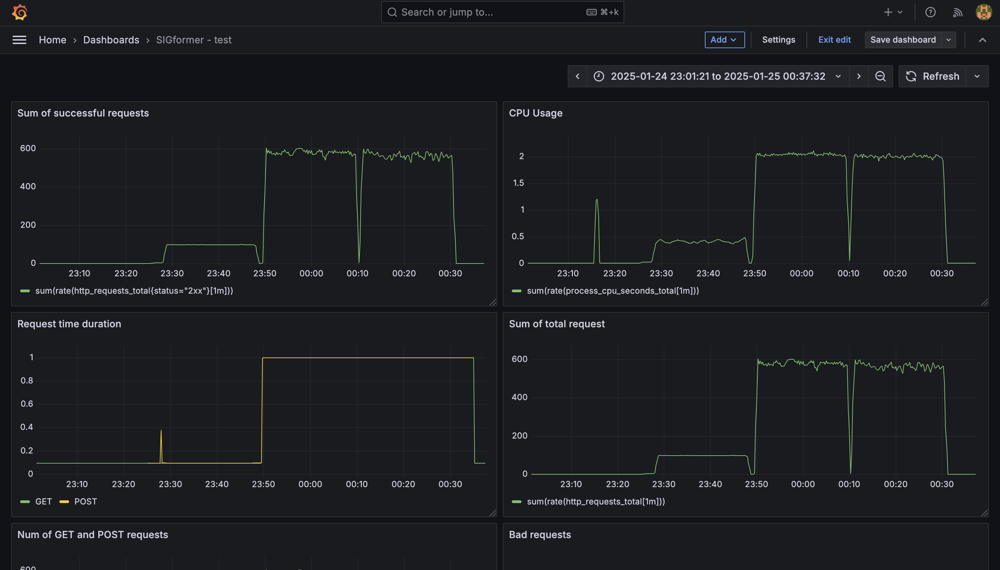
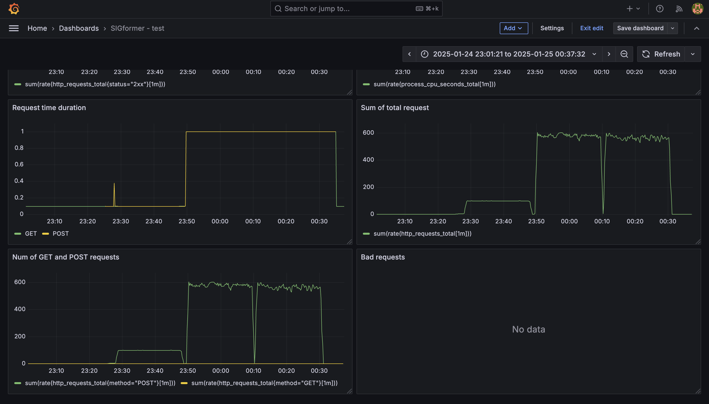

# SIGformer: Sign-aware Graph Transformer for Recommendation

Inference implementation for KuaiRand, implemented using FastAPI. Load testing was performed using k6 grafana. The metrics were collected using prometheus.

## How do I launch it?

- Download the docker image of grafana and prometheus:

```cmd
docker pull prom/prometheus:latest
docker pull grafana/grafana:latest
```

- Build the images:

```cmd
docker-compose up -d --build
```

Ready! The application is running on ```http://localhost:8080```! You can get recommendations using a post request ```http://localhost:8080/recommendations\```.

Also you can set up a dashboard in grafana using Prometheus and monitor the status of requests and the load.

If you want to run the application without grafana and prometheus, then simply run:

```cmd
poetry install
poetry run uvicorn model.app:app --host 0.0.0.0 --port 8080
```

## Load testing results

There were three launches: for 100 users for 20 minutes, for 2500 users for 20 minutes and 5000 users for 20 minutes. The logs of each launch can be viewed in the test_results/logs folder.

We got the following metrics results:



