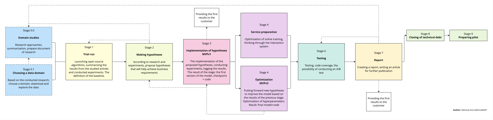

# ML System Design Doc - [En]

## ML System Design - \<Graph-based recommender systems with explicit negative feedback encoding\> \<MVP\> \<0.1.0\>

This project belongs to **research projects**. The expected results of all the work will be **an article** describing the proposed approach and the implementation of **mvp** in the form of an algorithm.

**The project started:** October 15, 2024

**Expected end date:** June 2025

> ## Terms and explanations
>
> - User - the user of the recommendation system. This can be a person interacting with the platform, for example, watching movies, buying goods or leaving reviews.
> - Item - an object that can be recommended to the user. Examples: a movie, a product, a restaurant, an article.
> - Explicit Feedback - feedback provided by the user, such as ratings (1-5 stars), likes, dislikes, or text reviews.
> - Negative Feedback - feedback indicating that the user is not interested in the item (for example, a low rating, dislike, or refusal to purchase).
> - Graph - a data structure where nodes (vertices) represent objects such as users and elements, and edges denote interactions between them. In the graph, the user is represented as a node connected to elements through edges.
> - Edge - connecting two nodes. In a project, this can be an interaction between a user and an element, complemented by a weight reflecting the strength or type of interaction (for example, a positive or negative feedback).
> - Node - representing a user or element.
> - Graph Neural Networks(GNN) - a type of neural networks that work with graph data structures to train representations of nodes, edges, or the entire graph.
> - Cold Start Problem - a problem that occurs when there is no data about new users or items, which makes it difficult to generate recommendations.
> - Embedding - mathematical representation of graph nodes in the form of dense vectors that are used in models to generate recommendations.
> - Recall@k - a metric that measures the proportion of relevant items in the set of recommended items.
> - NDCG (Normalized Discounted Cumulative Gain) - a metric used to evaluate the quality of a ranking algorithm by measuring how well relevant items are positioned at the top of the recommendation list.

### 1. Goals and prerequisites

#### 1.1. Why are we going into product development?

**Business Purpose:**

- Increase customer conversion and retention by instantly adapting to their mood and preferences.
- Save money by reducing the need for computing resources.

<!--
- Develop a model that is less demanding in terms of both time training and memory requirements of the algorithm for **online training** implementation, in order to reduce resource consumption during system maintenance. Most modern research focuses on offline training, so this is a significant improvement.
- To increase customer satisfaction by ensuring recommendations do not degrade by more than 15% in Recall@k and NDCG@k metrics, or by improving their quality on datasets (specific figures and datasets will be provided after the domain selection phase, with a deadline of December 8).
- Short-Term Goals: identify and outline challenges with existing SOTA GNN algorithms. -->

**Why will it get better than it is now from using ML:**
Classic recommender systems usually handle negative feedback only in the loss for better classification, ranking, or rating prediction. At the same time, information that the user is not interested in is very useful and reduces the risk of unwanted items. In addition, the training/retraining process typically occurs offline and on a periodic basis. This means that users' interests are updated only once per iteration of the retraining process, which can lead to decreased user satisfaction and significant resource costs.

**What are the criteria for the success of an iteration from a business standpoint:**

1. Performance improvement:
   - Achieve comparable or better results than existing SOTA GNN-based recommendation systems in terms of key metrics (Recall@k, NDCG@k).
   - Ensure that the quality of recommendations does not degrade by more than 15% when transitioning from offline to online training.
2. Resource efficiency:
   - Reduce memory usage during both training and inference phases by at least 20%, compared to baseline GNN-based models, which uses negative feedback.
   - Decrease training time by a measurable margin (e.g., 20%) while maintaining or improving recommendation quality.
3. Risk reduction:
   - Minimize exposure to negative customer experiences by effectively utilizing explicit negative feedback, ensuring fewer irrelevant or unwanted recommendations.
4. Adaptability and responsiveness:
   - Enable near real-time updates of user preferences, reducing the time lag between user interactions and the system's ability to reflect those changes in recommendations.

#### 1.2. Business requirements and restrictions

##### 1.2.1. Brief description of business requirements

The goal of the project is to create a system of recommendations that:

1. Utilizes graph structures in order to account for explicit negative feedback, thereby improving the accuracy and reducing the likelihood of undesirable recommendations.
2. The system should be able to update the model in real-time, ensuring that the recommendations are current as user preferences change.
3. The system should consume fewer resources compared to other state-of-the-art algorithms while maintaining scalability for large graphs.
4. Reduce memory usage both at the learning stage and at the logical inference stage by at least 20%. The decrease in the quality of Recall@k and NDCG@k metrics is no more than 15%, but the priority is to save and increase the metrics.

##### 1.2.2. Target vision

- **Machine learning (ML) operates** on the principle of a request-response system. The user initiates a session, during which the model receives input information about the user's behavior and interaction with items and provides a list of items that, according to the model's opinion, are suitable for the user at that time.
- **Business requirements:** The response time should be no more than 10 seconds, ideally 2-3 seconds.
- A **successful model** is one that meets the above criteria in section <<**Brief description of business requirements**>>.
- **Possible project development steps:**
  1. Step 1 (v0.1.0): Conduct a review of current state-of-the-art algorithms (GNN and negative feedback) and choose a research domain. Select a dataset and conduct exploratory data analysis (EDA). Subsequent versions (0.1.1, 0.1.2, etc.) will differ in terms of additions and decisions made during each iteration of the research process.
  2. Step 2 (v0.2.0): Launching open-source approaches on selected datasets, summarizing the results of the study, and launching to fix requirements for the final goal. Hypotheses for improving models. The versions of documents differ in terms of additions to the progress of project introduction and implementation of open-source approaches for selected datasets.
  3. Step 3 (v1.0.0): Implementation of hypotheses and conducting experiments. Selection of best hypotheses and a new iteration of hypotheses. Versions differ in accuracy, with sub-versions focusing on convenience and stability.
  4. Step 4 (v2.0.0): Preparation of the article. Consideration of A/B testing options. Presentation of results.
- **Data:** Selected domains: music recommendation, short-video recomendation. Datasets: [SberZvuk](https://www.kaggle.com/datasets/alexxl/zvuk-dataset), [KuaiRand](https://kuairand.com/). The version of the datasets is not final. When preparing the MVP and beating the baseline, our model plans to expand the list of datasets.
- **Performers:** Sidorova Anna <<anna.pav.sidorova@gmail.com>>, Tishin Roman < empty >.

##### 1.2.3. Business requirements and restrictions for the pilot [at the approval stage]

Basically, the requirements are similar, the most important thing is to provide **online training**.

A successful pilot project that has met the criteria for the project requirements has been implemented in Python. The entire project and research have been summarized in the form of an article.

##### 1.2.4. Conducting a pilot [at the approval stage]

The main testing is expected to be based on historical data. There is a possibility of conducting an A/B test for SberZvuk.

In the pilot project, the algorithm provides users with a list of items that model believes may be of interest based on information about the user and their previous interactions. This model requires online training in order to continuously update recommendations and ensure they are relevant and timely. Simultaneously, the quality of the recommendations will be assessed using metrics Recall@k and NDCG@k.

##### 1.2.5. Business restrictions

- **Environment:** development at AIRI facilities on a remote server, with a separate virtual machine in a local cluster environment.
- **Stack technologies:** Python3, PyTorch-Geometric, FastAPI, Polars/Pandas.
- **Resources:** Limitation on available computing power (for example, using a GPU/CPU with a fixed configuration). According to the research, GPUs with at least 24GB of available video memory were used.
- **Timeline:** The first working version should be ready for testing by June 2025.
- **Data:** User and element graphs can contain tens of millions of nodes and edges, which requires scalable solutions.
- **Requirements:** Due to the need to simplify the process, there may be a risk of compromising the accuracy of the metrics presented.

#### 1.3. What is included in the scope of the project/iteration, what is not included

**What is included:**

- Conducting a study and creating a research report in the form of an artifact file in .pdf format, including a summary of the articles reviewed, their limitations, and ideas for future improvements.
- Selection of a domain and dataset, as well as analysis of the data. The results of previous studies will be summarized, and hypotheses will be formulated based on these findings.
- Development and implementation of a grap model.
- Implementation of methods for processing negative feedback.
- Conduction of experiments and evaluation using quality metrics.

**What is not included:**

- Full integration of the developed solution into the production system.
- Visualization of recommendations for end users.

**Description of the results in terms of the quality of the code and reproducibility of the solution:**

The code is deemed to be of high quality if the system functions properly, the code coverage exceeds 85%, and it has been validated by linters and formatters. Additionally, the code should contain comments describing each method.

The code can be considered reproducible if all project dependencies are documented and the code functions correctly when those dependencies are executed.

As part of the ongoing design and development process, areas that require additional refinement for full model productivity will be identified. **The planned technical debt includes the following:**

1. **Model integration into production environment**

   - **REST API:** Development and testing of an API for model interaction with other system components (prototype).
   - **Online learning infrastructure**: Creation of a pipeline to automatically process new user data and train the model in real-time.
   - **Monitoring:** Setting up a system to monitor quality metrics (RECALL@k, NDCG@k) and model performance (response time, memory, and resource consumption).

2. **Data Processing**

   - Automating data preparation processes including cleaning, gap filling, and feature generation.

3. **Model Optimization**

   - **Hyperparameter Tuning:** Optimizing hyperparameters to improve model performance under real-world conditions.
   - **Memory Efficiency:** Reducing memory requirements and accelerating processing.
   - **Scalability:** Scaling up the model and infrastructure to handle large graphs (with 10M+ nodes and edges) without significant degradation in performance.

4. **Version Control**

   - **Data Versioning:** Storing multiple versions of training data to ensure reproducibility.
   - **Model Versioning:** Establishing a system for managing and storing different model versions, including optimized loading and switching between them.

5. **Testing and Validation**

   - **Testing:** Conducting rigorous testing to ensure accuracy and robustness of the model.
   - **Validation:** Verifying the effectiveness of the model on new data sets.
   - **Unit testing and integration testing:** Development of tests to verify the accuracy of the code and the functionality of the model within the system.
   - **A/B testing:** Implementation of tools to evaluate the impact of recommendations on user behavior in a production setting.

6. **Documentation**

   - **Technical documentation:** Completion of a description of the graph structure, model architecture, and training/prediction pipelines.
   - **User documentation:** Creation of instructions for the use of the model for analysts and developers.

#### 1.4. Background of the decision

General requirements for the solution. The project is based on the following requirements, which are in line with business needs and data characteristics:

1. **Data elements used in the system:**

   - **User information:** User ID, behavioral patterns (interactions with the platform), history of user interactions with items, including positive and explicit negative feedback.
   - **Item information:** Characteristics of items, such as category, description, popularity. Similarity between items, based on common tags or categories.
   - **Graphical data:** User interactions modeled as a graph, where nodes represent users and items, and edges represent interactions. Types of interactions include positive, explicit negative, and neutral (e.g., viewing without action) interactions.
   - **Contextual information** (if available), such as timestamps (interaction time) and localization (region, language) data.

2. **Forecast Horizon** – Short-Term Forecast

3. **Model Granularity**

   - **User level:** Personalized recommendations for individual users based on their historical interactions and explicit negative feedback.
   - **Element level:** Identification of elements that are likely to be either rejected or accepted by specific users.
   - **Segment level:** Ability to group users and elements in clusters for optimized learning.

4. **Justification for Prerequisite Selection**

   - **Business Requirement:** Businesses require consideration of both positive and negative signals to enhance the quality of recommendations. Rapid model adaptation allows for quicker response to user preference changes and reduced risk of irrelevant recommendations.
   - **Data availability:** Due to the presence of a clear negative feedback, the graph data structure best reflects user interactions with elements. The use of contextual data and time stamps improves the accuracy of short-term predictions.
   - **Technical capabilities:** Modern frameworks, such as PyTorch Geometric, support training graph models on large datasets, allowing for scaling solutions for business problems.

5. **Intended data and process architecture:**
   - **Users and elements** are represented as nodes in a graph. Interactions between users and elements, as well as meta-information such as timestamps and weight coefficients, are represented by edges.
   - **Stages of working with data:** Data is cleaned and transformed to construct the graph. The graph is incrementally updated as new data becomes available. A model is trained to predict the likelihood of user interaction with an element.
   - **Quality metrics:** Main metrics include Recall@k and NDCG@k.

### 2. Methodology

#### 2.1. Setting the task

Creation of a recommendation system with the possibility of online training.

#### 2.2. The block diagram of the solution

