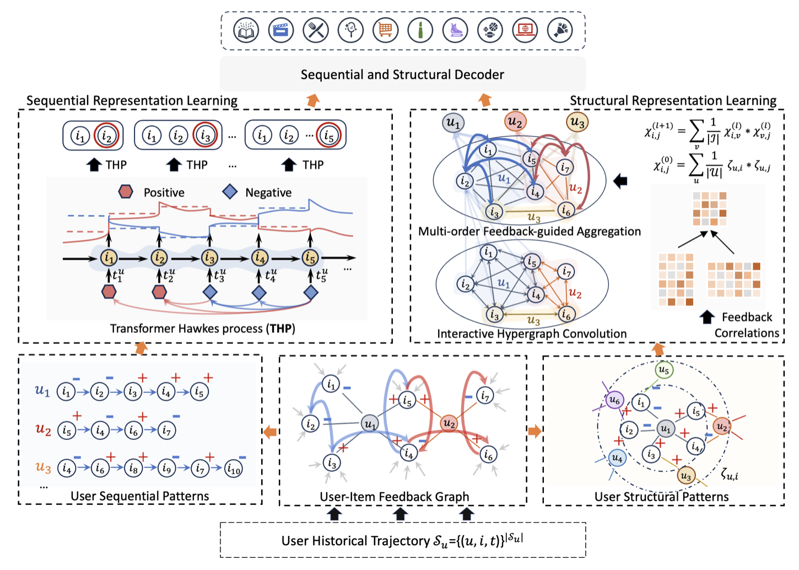
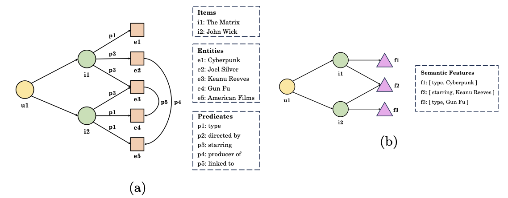
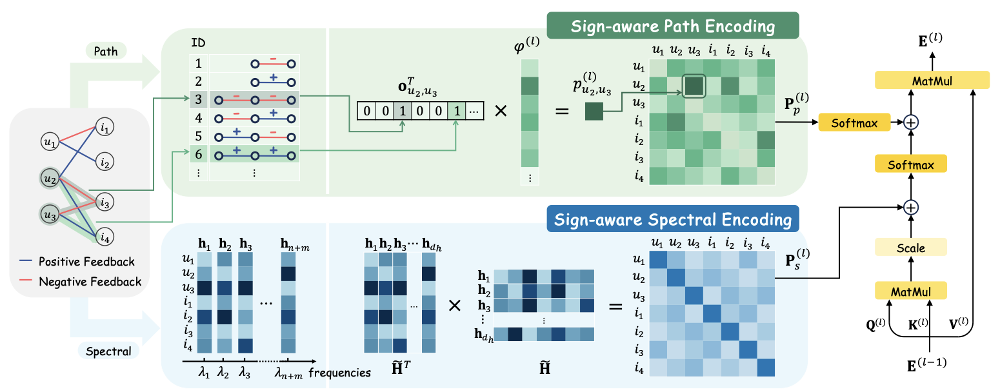
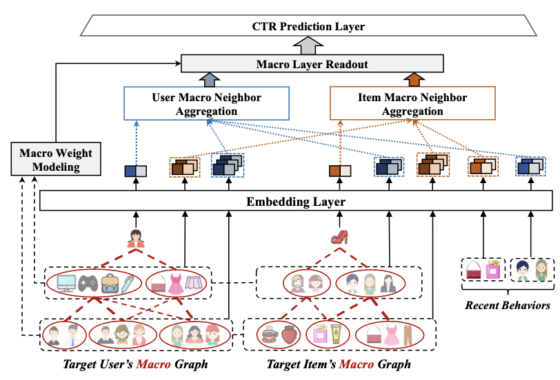
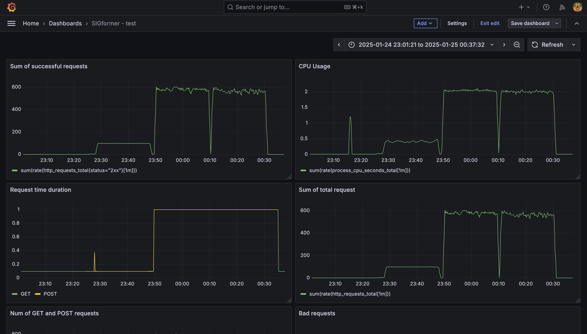
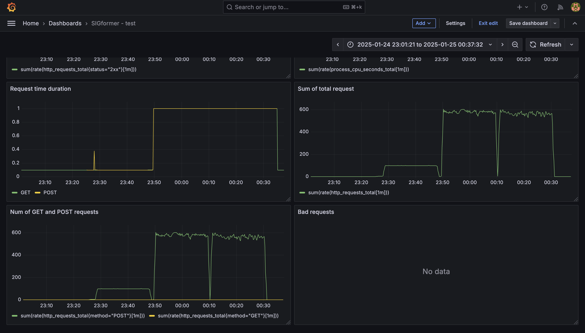
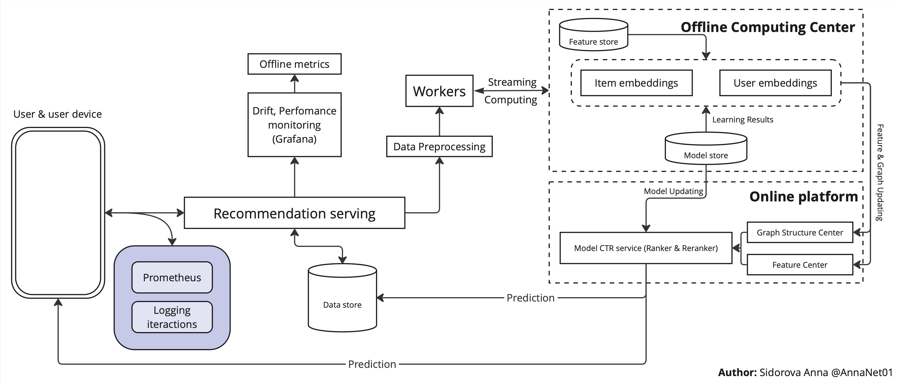

# ML System Design Doc - [En]

## ML System Design - \<Graph-based recommender systems with explicit negative feedback encoding\> \<MVP\> \<0.2.0\>

This project belongs to **research projects**. The expected results of all the work will be **an article** describing the proposed approach and the implementation of **mvp** in the form of an algorithm.

**The project started:** October 15, 2024

**Expected end date:** June 2025

> ## Terms and explanations
>
> - User - the user of the recommendation system. This can be a person interacting with the platform, for example, watching movies, buying goods or leaving reviews.
> - Item - an object that can be recommended to the user. Examples: a movie, a product, a restaurant, an article.
> - Explicit Feedback - feedback provided by the user, such as ratings (1-5 stars), likes, dislikes, or text reviews.
> - Negative Feedback - feedback indicating that the user is not interested in the item (for example, a low rating, dislike, or refusal to purchase).
> - Graph - a data structure where nodes (vertices) represent objects such as users and elements, and edges denote interactions between them. In the graph, the user is represented as a node connected to elements through edges.
> - Edge - connecting two nodes. In a project, this can be an interaction between a user and an element, complemented by a weight reflecting the strength or type of interaction (for example, a positive or negative feedback).
> - Node - representing a user or element.
> - Graph Neural Networks(GNN) - a type of neural networks that work with graph data structures to train representations of nodes, edges, or the entire graph.
> - Cold Start Problem - a problem that occurs when there is no data about new users or items, which makes it difficult to generate recommendations.
> - Embedding - mathematical representation of graph nodes in the form of dense vectors that are used in models to generate recommendations.
> - Recall@k - a metric that measures the proportion of relevant items in the set of recommended items.
> - NDCG (Normalized Discounted Cumulative Gain) - a metric used to evaluate the quality of a ranking algorithm by measuring how well relevant items are positioned at the top of the recommendation list.

### 1. Goals and prerequisites

#### 1.1. Why are we going into product development?

**Business Purpose:**

- Increase customer conversion and retention by instantly adapting to their mood and preferences.
- Save money by reducing the need for computing resources.

<!--
- Develop a model that is less demanding in terms of both time training and memory requirements of the algorithm for **online training** implementation, in order to reduce resource consumption during system maintenance. Most modern research focuses on offline training, so this is a significant improvement.
- To increase customer satisfaction by ensuring recommendations do not degrade by more than 15% in Recall@k and NDCG@k metrics, or by improving their quality on datasets (specific figures and datasets will be provided after the domain selection phase, with a deadline of December 8).
- Short-Term Goals: identify and outline challenges with existing SOTA GNN algorithms. -->

**Why will it get better than it is now from using ML:**

Classic recommender systems usually handle negative feedback only in the loss for better classification, ranking, or rating prediction. At the same time, information that the user is not interested in is very useful and reduces the risk of unwanted items. In addition, the training/retraining process typically occurs offline and on a periodic basis. This means that users' interests are updated only once per iteration of the retraining process, which can lead to decreased user satisfaction and significant resource costs.

**What are the criteria for the success of an iteration from a business standpoint:**

1. Performance improvement:
   - Achieve comparable or better results than existing SOTA GNN-based recommendation systems in terms of key metrics (Recall@k, NDCG@k).
   - Ensure that the quality of recommendations does not degrade by more than 15% when transitioning from offline to online training.
2. Resource efficiency:
   - Reduce memory usage during both training and inference phases by at least 20%, compared to baseline GNN-based models, which uses negative feedback.
   - Decrease training time by a measurable margin (e.g., 20%) while maintaining or improving recommendation quality.
3. Risk reduction:
   - Minimize exposure to negative customer experiences by effectively utilizing explicit negative feedback, ensuring fewer irrelevant or unwanted recommendations.
4. Adaptability and responsiveness:
   - Enable near real-time updates of user preferences, reducing the time lag between user interactions and the system's ability to reflect those changes in recommendations.

#### 1.2. Business requirements and restrictions

##### 1.2.1. Brief description of business requirements

The goal of the project is to create a system of recommendations that:

1. Utilizes graph structures in order to account for explicit negative feedback, thereby improving the accuracy and reducing the likelihood of undesirable recommendations.
2. The system should be able to update the model in real-time, ensuring that the recommendations are current as user preferences change.
3. The system should consume fewer resources compared to other state-of-the-art algorithms while maintaining scalability for large graphs.
4. Reduce memory usage both at the learning stage and at the logical inference stage by at least 20%. The decrease in the quality of Recall@k and NDCG@k metrics is no more than 15%, but the priority is to save and increase the metrics.

##### 1.2.2. Target vision

- **Machine learning (ML) operates** on the principle of a request-response system. The user initiates a session, during which the model receives input information about the user's behavior and interaction with items and provides a list of items that, according to the model's opinion, are suitable for the user at that time.
- **Business requirements:** The response time should be no more than 10 seconds, ideally 2-3 seconds.
- A **successful model** is one that meets the above criteria in section <<**Brief description of business requirements**>>.
- **Possible project development steps:**
  1. Step 1 (v0.1.0): Conduct a review of current state-of-the-art algorithms (GNN and negative feedback) and choose a research domain. Select a dataset and conduct exploratory data analysis (EDA). Subsequent versions (0.1.1, 0.1.2, etc.) will differ in terms of additions and decisions made during each iteration of the research process.
  2. Step 2 (v0.2.0): Launching open-source approaches on selected datasets, summarizing the results of the study, and launching to fix requirements for the final goal. Hypotheses for improving models. The versions of documents differ in terms of additions to the progress of project introduction and implementation of open-source approaches for selected datasets.
  3. Step 3 (v1.0.0): Implementation of hypotheses and conducting experiments. Selection of best hypotheses and a new iteration of hypotheses. Versions differ in accuracy, with sub-versions focusing on convenience and stability.
  4. Step 4 (v2.0.0): Preparation of the article. Consideration of A/B testing options. Presentation of results.
- **Data:** Selected domains: music recommendation, short-video recomendation. Datasets: [SberZvuk](https://www.kaggle.com/datasets/alexxl/zvuk-dataset), [KuaiRand](https://kuairand.com/). The version of the datasets is not final. When preparing the MVP and beating the baseline, our model plans to expand the list of datasets.
- **Performers:** Sidorova Anna <<anna.pav.sidorova@gmail.com>>, Tishin Roman < empty >.

##### 1.2.3. Business requirements and restrictions for the pilot [at the approval stage]

Basically, the requirements are similar, the most important thing is to provide **online training**.

A successful pilot project that has met the criteria for the project requirements has been implemented in Python. The entire project and research have been summarized in the form of an article.

##### 1.2.4. Conducting a pilot [at the approval stage]

The main testing is expected to be based on historical data. There is a possibility of conducting an A/B test for SberZvuk.

In the pilot project, the algorithm provides users with a list of items that model believes may be of interest based on information about the user and their previous interactions. This model requires online training in order to continuously update recommendations and ensure they are relevant and timely. Simultaneously, the quality of the recommendations will be assessed using metrics Recall@k and NDCG@k.

##### 1.2.5. Business restrictions

- **Environment:** development at AIRI facilities on a remote server, with a separate virtual machine in a local cluster environment.
- **Stack technologies:** Python3, PyTorch-Geometric, FastAPI, Polars/Pandas.
- **Resources:** Limitation on available computing power (for example, using a GPU/CPU with a fixed configuration). According to the research, GPUs with at least 24GB of available video memory were used.
- **Timeline:** The first working version should be ready for testing by June 2025.
- **Data:** User and element graphs can contain tens of millions of nodes and edges, which requires scalable solutions.
- **Requirements:** Due to the need to simplify the process, there may be a risk of compromising the accuracy of the metrics presented.

#### 1.3. What is included in the scope of the project/iteration, what is not included

**What is included:**

- Conducting a study and creating a research report in the form of an artifact file in .pdf format, including a summary of the articles reviewed, their limitations, and ideas for future improvements.
- Selection of a domain and dataset, as well as analysis of the data. The results of previous studies will be summarized, and hypotheses will be formulated based on these findings.
- Development and implementation of a grap model.
- Implementation of methods for processing negative feedback.
- Conduction of experiments and evaluation using quality metrics.

**What is not included:**

- Full integration of the developed solution into the production system.
- Visualization of recommendations for end users.

**Description of the results in terms of the quality of the code and reproducibility of the solution:**

The code is deemed to be of high quality if the system functions properly, the code coverage exceeds 85%, and it has been validated by linters and formatters. Additionally, the code should contain comments describing each method.

The code can be considered reproducible if all project dependencies are documented and the code functions correctly when those dependencies are executed.

As part of the ongoing design and development process, areas that require additional refinement for full model productivity will be identified. **The planned technical debt includes the following:**

1. **Model integration into production environment**

   - **REST API:** Development and testing of an API for model interaction with other system components (prototype).
   - **Online learning infrastructure**: Creation of a pipeline to automatically process new user data and train the model in real-time.
   - **Monitoring:** Setting up a system to monitor quality metrics (RECALL@k, NDCG@k) and model performance (response time, memory, and resource consumption).

2. **Data Processing**

   - Automating data preparation processes including cleaning, gap filling, and feature generation.

3. **Model Optimization**

   - **Hyperparameter Tuning:** Optimizing hyperparameters to improve model performance under real-world conditions.
   - **Memory Efficiency:** Reducing memory requirements and accelerating processing.
   - **Scalability:** Scaling up the model and infrastructure to handle large graphs (with 10M+ nodes and edges) without significant degradation in performance.

4. **Version Control**

   - **Data Versioning:** Storing multiple versions of training data to ensure reproducibility.
   - **Model Versioning:** Establishing a system for managing and storing different model versions, including optimized loading and switching between them.

5. **Testing and Validation**

   - **Testing:** Conducting rigorous testing to ensure accuracy and robustness of the model.
   - **Validation:** Verifying the effectiveness of the model on new data sets.
   - **Unit testing and integration testing:** Development of tests to verify the accuracy of the code and the functionality of the model within the system.
   - **A/B testing:** Implementation of tools to evaluate the impact of recommendations on user behavior in a production setting.

6. **Documentation**

   - **Technical documentation:** Completion of a description of the graph structure, model architecture, and training/prediction pipelines.
   - **User documentation:** Creation of instructions for the use of the model for analysts and developers.

#### 1.4. Background of the decision

General requirements for the solution. The project is based on the following requirements, which are in line with business needs and data characteristics:

1. **Data elements used in the system:**

   - **User information:** User ID, behavioral patterns (interactions with the platform), history of user interactions with items, including positive and explicit negative feedback.
   - **Item information:** Characteristics of items, such as category, description, popularity. Similarity between items, based on common tags or categories.
   - **Graphical data:** User interactions modeled as a graph, where nodes represent users and items, and edges represent interactions. Types of interactions include positive, explicit negative, and neutral (e.g., viewing without action) interactions.
   - **Contextual information** (if available), such as timestamps (interaction time) and localization (region, language) data.

2. **Forecast Horizon** – Short-Term Forecast

3. **Model Granularity**

   - **User level:** Personalized recommendations for individual users based on their historical interactions and explicit negative feedback.
   - **Element level:** Identification of elements that are likely to be either rejected or accepted by specific users.
   - **Segment level:** Ability to group users and elements in clusters for optimized learning.

4. **Justification for Prerequisite Selection**

   - **Business Requirement:** Businesses require consideration of both positive and negative signals to enhance the quality of recommendations. Rapid model adaptation allows for quicker response to user preference changes and reduced risk of irrelevant recommendations.
   - **Data availability:** Due to the presence of a clear negative feedback, the graph data structure best reflects user interactions with elements. The use of contextual data and time stamps improves the accuracy of short-term predictions.
   - **Technical capabilities:** Modern frameworks, such as PyTorch Geometric, support training graph models on large datasets, allowing for scaling solutions for business problems.

5. **Intended data and process architecture:**
   - **Users and elements** are represented as nodes in a graph. Interactions between users and elements, as well as meta-information such as timestamps and weight coefficients, are represented by edges.
   - **Stages of working with data:** Data is cleaned and transformed to construct the graph. The graph is incrementally updated as new data becomes available. A model is trained to predict the likelihood of user interaction with an element.
   - **Quality metrics:** Main metrics include Recall@k and NDCG@k.

### 2. Methodology

#### 2.1. Setting the task

Creation of a recommendation system with the possibility of online training.

#### 2.2. The block diagram of the solution

#### 2.3. The stages of problem solving

##### Stage 1. Data preparation

- **Step 1. Data collection, feature selection, analysis.**
  Download the data from the following sites: [SberZvuk](https://www.kaggle.com/datasets/alexxl/zvuk-dataset), [KuaiRand](https://kuairand.com/). We upload them to Jupiter's notebook. When selecting, we check the completeness of the data, the presence of missing values, and make a description of the presented features. As a result, we get an initial representation of the data.

  For further work with the data, we will need to come up with a feedback processing algorithm, that is, turn the implicit feedback into an explicit one.

1. [SberZvuk](https://www.kaggle.com/datasets/alexxl/zvuk-dataset)

**The target variable:**

| The name of the data | Does the company have data (if so, the name of the source/storefronts) | Required resource for data acquisition (which roles are needed) | Has the data quality been checked (yes, no) |
|----------|----------|----------|----------|
| Play duration | zvuk-interactions.parquet/platform log | DE | + |

**Features:**

| The name of the data | Does the company have data (if so, the name of the source/storefronts) | Required resource for data acquisition (which roles are needed) | Has the data quality been checked (yes, no) |
|----------|----------|----------|----------|
| User ID | zvuk-interactions.parquet / values stored in the database | DE | + |
| User sessions with interactions | zvuk-interactions.parquet / platform log | DE | + |
| Datetime of interactions | zvuk-interactions.parquet / platform log | DE | - |
| Tracks ID | zvuk-interactions.parquet / values stored in the database | DE | + |
| Artist ID | zvuk-track_artist_embedding.parquet / values stored in the database | DE | - |
| Clustert of track ID | zvuk-track_artist_embedding.parquet / from the system or using the clustering model | DS | - |
| Embedding of track ID | zvuk-track_artist_embedding.parquet /  | DS | + |

**Possible challenges:** this dataset lacks explicit feedback, which poses difficulties in constructing the system. In order to address this issue, preprocessing is required, allowing for the extraction of implicit negative/positive feedback to explicit feedback with a certain degree of inaccuracy. For instance, a threshold accounting of the number of auditions can be used, along with information regarding the duration of each audition.

2. [KuaiRand](https://kuairand.com/)

Due to the large number of entities, they were grouped. For more information, see the link above.

**The target variable:**

| The name of the data | Does the company have data (if so, the name of the source/storefronts) | Required resource for data acquisition (which roles are needed) | Has the data quality been checked (yes, no) |
|----------|----------|----------|----------|
| Engagement | log_random_4_22_to_5_08.csv / log_standard_4_22_to_5_08.csv / log_standard_4_08_to_4_21.csv / logs from app | DE | + |

**Features:**

| The name of the data | Does the company have data (if so, the name of the source/storefronts) | Required resource for data acquisition (which roles are needed) | Has the data quality been checked (yes, no) |
|----------|----------|----------|----------|
| IDs (user/video/author/music) | log_random_4_22_to_5_08.csv / log_standard_4_22_to_5_08.csv / log_standard_4_08_to_4_21.csv / video_features_basic.csv / logs from app | DE | + |
| User's feedback (click/dislike/comment/etc) | log_random_4_22_to_5_08.csv / log_standard_4_22_to_5_08.csv / log_standard_4_08_to_4_21.csv / video_features_basic.csv / logs from app | DE | - |
| User's profile info | user_features.csv / info from app | DE | - |
| User's features | user_features.csv / info from app | DS | - |
| Basic video features | video_features_basic.csv / logs from app | DE | - |
| Video statistics | video_features_statistic.csv / logs from app | DE | - |

**MVP:** Jupiter's notebook with loaded attributes. Notebooks located in [eda folder](../eda), to select a domain, a [document](../research_documents/AIRI_datasets_research.pdf) describing existing datasets with links, a description, and pros and cons is also available.

- **Step 2: Data processing and preparation for training.**
In this step, we clean the data by removing outliers (a small number of interactions) and fill missing values for KuaiRand. KuaiRand also requaries feature engineering step. For data with no explicit feedback, we create a preprocessing function to separate implicit and explicit feedback. For each user, their interactions are divided into four categories: explicit positive, implicit positive, explicit negative, and implicit negative.
The description of the sample creation for training, testing, and validation is as follows: all user interactions serve as the basis for the data, which are then divided into these four categories. The data is divided into subsamples according to a time frame specified in the dataset. Most of the older data is used for training per user, while the newer data is reserved for validation and testing purposes.

**MVP:** The data that has been prepared for model and baseline building.

**Sum:**

- As the project is primarily a research initiative, the data has been sourced from open-source repositories and is already in the form of CSV or Parquet tables.
- No additional data generation is required.
- It should be noted that the selected dataset is quite extensive, large computing resources are required.
- There is confidential information, but it has already been encrypted by the creators of the original dataset.
- There is an imbalance in the negative feedback within the datasets, which must be considered when constructing a system.
- In a real-world setting, data will originate from the service and each user interaction will be recorded in the database. For off-line learning, the database will aggregate interactions and ultimately be employed for retraining. For online learning, in addition to storing data, it will be immediately incorporated into the model.

##### Stage 2. Preparation of predictive models

- **Step 3: Exploring current approaches to selecting a baseline model.**
  At this step, we explore the current state-of-the-art algorithms in the field of *Graph-based recommender systems with explicit negative feedback encoding*. The research has been conducted and is available at [this link](../research_documents/AIRI_research.pdf).

  At this stage, general approaches are identified, problems are highlighted, and open methods are sought for launching the baseline.

  **Identified limitations** (briefly; more details can be found in the presentation):
  - High Computational Complexity
    - Scalability Challenges for Real-World Applications
    - Trade-Offs in Resource Allocation
    - Impracticality of Online Learning
  - Prediction Smoothing
  - Accounting for All Negative Interactions
    - Imbalance-Induced Overfitting
    - Noise in Negative Interactions
    - Lack of Hierarchical Handling of Negatives
  - Static Graph Assumption
    - Inability to Handle Temporal Dynamics
    - Over-Reliance on Offline Training

  Identified open source solutions:

| Approach | github link |
|----------|----------|
| [NFARec](https://ar5iv.labs.arxiv.org/html/2404.06900) | [link](https://github.com/WangXFng/NFARec) |
| [TGT](https://paperswithcode.com/paper/multi-behavior-sequential-recommendation-with) | [link](https://github.com/akaxlh/tgt) |
| [KGUF](https://arxiv.org/pdf/2403.20095v1) | [link](https://github.com/sisinflab/KGUF) |
| [RNS over KG](https://paperswithcode.com/paper/reinforced-negative-sampling-over-knowledge) | [link](https://github.com/xiangwang1223/kgpolicy) |
| [RevGNN](https://arxiv.org/pdf/2407.20684) | [link](https://github.com/THUDM/Reviewer-Rec) |
| [SBNR](https://arxiv.org/abs/2205.06058) | [link](https://github.com/summmeer/session-based-news-recommendation) |
| [SIGformer](https://arxiv.org/pdf/2404.11982) | [link](https://github.com/StupidThree/SIGformer) |
| [AGL-SC](https://arxiv.org/html/2406.18984v2) | [link](https://github.com/yp8976/AGL_SC) |
| [MacGNN](https://paperswithcode.com/paper/macro-graph-neural-networks-for-online) | [link](https://github.com/YuanchenBei/MacGNN) |

**MVP:** [Document](../research_documents/AIRI_research.pdf) with research and conclusions.

- **Step 4: Selecting and launching a baseline model.**
  From the list of models identified in **Step 3**, a baseline model should be selected. The main selection criteria include: high metrics on datasets, simplicity of implementation, available computational resources, and configured versions of the libraries in use. The following methods meet these criteria:

  1. [NFARec](https://ar5iv.labs.arxiv.org/html/2404.06900): Takes negative feedback into account to improve recommendations. Utilizes hypergraph convolutions and the Transformer Hawkes Process to analyze temporal dynamics.

   
  $`
\mathcal{L}_{main} = \sum_{(u \in \mathcal{U})} \sum_{(i \in \mathcal{I})} c_{u, i} \cdot \gamma_i^{(u)} \log(\alpha_4(\hat{R}_{u, i})),
`$
   where:
  - $`\gamma^{(u)} \in \mathbb{R}^{|\mathcal{I}|}`$ represents a label vector, in which each element equals 1 if the corresponding item is a ground-truth candidate; otherwise, 0.
  - $`\alpha_4`$ denotes the sigmoid activation function.
  - $`c_{u, i}`$ is set to: $`\beta_1`$ when the user has interacted with the item, $`\beta_2`$ when the user will interact with the item, and 0 otherwise.
  - $`\hat{R}_{u, i}`$ is the predicted score for user $`u`$ and item $`i`$.
   $`
   \mathcal{L}_{auxi} = \sum_{(u \in \mathcal{U})} \left( \sum_{j=1}^{|\mathcal{S}_u|} \log \lambda(t_j | \mathcal{T}_t) - \int_{t_1}^{t^{|\mathcal{S}_u|}} \lambda(t | \mathcal{T}_t) \, dt \right),
    `$
   where:
  - $`\mathcal{S}_u`$ is the sequence of user \(u\)'s interactions.
  - $`\lambda(t | \mathcal{T}_t)`$ represents the intensity function for user interactions at time $`t`$.
    $`
   \mathcal{L}_{final} = \mathcal{L}_{main} + \delta_2 \mathcal{L}_{auxi},
    `$

  2. [KGUF](https://arxiv.org/pdf/2403.20095v1): It is based on knowledge of graphs and filtering of user semantic features, which improves the quality of recommendations.

   

   $`\mathcal{L}_{BPR} = \sum_{(u, i^+, i^-) \in \mathcal{T}} -\ln \sigma(\hat{r}_{ui^+} - \hat{r}_{ui^-}),`$ where:

   - $`\mathcal{T} = \{(u, i^+, i^-) | (u, i^+) \in \mathcal{R}, (u, i^-) \notin \mathcal{R}, i^- \in \mathcal{I} \}`$ is the training set, with $`i^+`$ being a positive item and $`i^-`$ being a negative item.

   - $`\sigma`$ represents the sigmoid activation function.

   - $`\hat{r}_{ui^+}`$ and $`\hat{r}_{ui^-}`$ are the predicted scores for positive and negative items, respectively.

   $`
   \mathcal{L} = \mathcal{L}_{BPR} + \lambda \| \Theta \|_2^2,
   `$ where:

   - $`\Theta`$ includes all learnable parameters, specifically:

   - $`\Theta = \{e_u, e_i, e_f \, | \, u \in \mathcal{U}, i \in \mathcal{I}, f \in \bigcup_{i \in \mathcal{I}} \mathcal{F}_i^* \}`$

  3. [SIGformer](https://arxiv.org/pdf/2404.11982): Graph transformer architecture based on feedback polarity (positive and negative).

   

   $` \mathcal{L} = - \sum_{(u, i) \in \mathcal{E}^+} \ln \sigma(\hat{y}_{ui} - \hat{y}_{uj}) + \sum_{(u, i) \in \mathcal{E}^-} \ln \sigma(\beta (\hat{y}_{ui} - \hat{y}_{uj})),`$ where:

  - $`\mathcal{E}^+`$ and $`\mathcal{E}^-`$ represent sets of positive and negative feedback, respectively.

  - For each feedback pair $`(u, i)`$, an item $`j \in \{j \in \mathcal{I} | y_{uj} = '?' \}`$ is sampled, where the user $`u`$ has not interacted with $`j`$, for model optimization.

  - $`\sigma`$ denotes the sigmoid function.

  - $`\beta`$ is a hyperparameter that balances the influence of negative feedback.

  - $`\hat{y}_{ui}`$ and $`\hat{y}_{uj}`$ are predicted scores for the respective items $`i`$ and $`j`$.

  4. [MacGNN](https://paperswithcode.com/paper/macro-graph-neural-networks-for-online): A macrographic neural network for online recommendations with big data, providing effective aggregation of information.

   

   The binary cross-entropy loss function is defined as:

   $`\mathcal{L}_{\text{bce}} = -\frac{1}{|\mathcal{T}|} \sum_{(u,i) \in \mathcal{T}} \left[ y_{u,i} \log(\hat{y}_{u,i}) + (1 - y_{u,i}) \log(1 - \hat{y}_{u,i}) \right],`$

   where $`\hat{y}_{u,i}`$ is the predicted CTR, and $`y_{u,i}`$ is the ground-truth label.

   The overall objective function of MacGNN is defined as:

   $`\mathcal{L} = \mathcal{L}_{\text{bce}} + \lambda \cdot \|\theta\|_2^2,`$

   where $`\lambda \cdot \|\theta\|_2^2`$ denotes the $`L_2\) regularization term to avoid overfitting.

---
**Metrics:**
The following metrics are used to evaluate the performance of the model:

- **Precision@K**:

  $`Precision@K = \frac{1}{K} \sum_{i=1}^{K} \text{relevance}(i)`$

  where $`\text{relevance}(i)`$ is an indicator of the relevance of the $`i`$-th item in the list.

- **Recall@K**:

  $`Recall@K = \frac{\sum_{i=1}^{K} \text{relevance}(i)}{\text{Total Relevant Items}}`$

- **NDCG@K (Normalized Discounted Cumulative Gain)**:
  $`
  NDCG@K = \frac{DCG@K}{IDCG@K}, \quad DCG@K = \sum_{i=1}^{K} \frac{\text{relevance}(i)}{\log_2(i+1)}`$

  where $`IDCG@K`$ is the ideal cumulative gain.

- **AUC (Area Under Curve)**:

  $`AUC = \frac{1}{|P||N|} \sum_{p \in P} \sum_{n \in N} \mathbb{I}(s_p > s_n)`$

  where $`P`$ and $`N`$ are sets of positive and negative examples, $`s_p`$ and $`s_n`$ are their scores.

---

**Description of the ML Validation Scheme:**

Given the specifics of the data and business tasks, the validation scheme is constructed as follows:

- **Data Splitting**:
  70% of the data is used for training, 15% for validation, and 15% for testing, employing a temporal split due to the presence of timestamps.

- **Time-Series Validation**:
  The data is divided into \(K\) folds, each taking turns being the validation set while the others form the training set. This is used for hyperparameter tuning.

---

**Risks at This Stage and Mitigation Strategies:**

1. **Overfitting**:
   Use of Dropout, $`L_1`$ and $`L_2`$ regularization, and contrastive learning.
2. **Prediction Smoothing**:
   Application of overfitting mitigation techniques and reduction in model complexity.
3. **Lack of Computational Resources**
4. **Challenges with Dependencies and Running Open Code on New Datasets**

---

**MVP:** A working baseline with quality metrics for selected datasets, and GitHub branches with prepared and configured environments for each method.

##### Stage 3. Hypothesizing a Model and Testing on the Data

This stage is one of the most critical for this research. It involves defining the idea of a future model that should address some or all of the limitations described in Stage 2, Step 3.

- **Step 5:** In this context, we propose (at a high level for now, with more detailed architecture to follow after the baseline step):

**Development Ideas:**

- Study the relationship between the presence and absence of edges among all users.
- Select and describe a ranking model.
- Explore the "weight" of the proposed model.
- Develop a model inference pipeline to support online learning.
- Combine the loss proposed in the above methods with contrastive learning.
- Expand the idea of using "emotional" nodes: for explicitly expressive feedback, remember all items; for implicit feedback, implement a forgetting curve. References: boss nodes from NLP.

**MVP:** The described hypothesis.

- **Step 6:** Conduct experiments. To assess the quality of the hypothesis, a set of experiments needs to be conducted, with results logged in CometML for reproducibility.

In case of failure, return to Step 5 and formulate new hypotheses.

**MVP:** A repository with experiments and final code in the main branch on GitHub.

##### Stage 4. Preparation of the Article

This is the final stage where all results are summarized, and conclusions about the hypothesis and experiments are written.

**MVP:** The article.

### 3. Baseline

#### 3.1 Iteration of experiments & Baseline results

The data selected for this study is extensive. The simplified KuaiRand dataset alone contains 1,000 users and 34 million items! Due to resource constraints at this point (a trial run for baseline comparison in our publication), we have decided to follow the lead of our scientific community colleagues and reduce the data, taking only the interactions that were used to launch the two solutions ([NFARec](https://ar5iv.labs.arxiv.org/html/2404.06900) and [SIGformer](https://arxiv.org/pdf/2404.11982)) that have been published so far, and two additional solutions are currently in the pipeline.
Currently, two solutions, x and y, have been released, with two more expected soon.
As of this moment, the following results have been obtained (subject to further updates):

| Approach | Dataset | Recall@20 | Precision@20 | NDCG@20 |
|----------|----------|----------|----------|----------|
| [SIGformer](https://github.com/Laitielly/gnn-recommender/tree/sigformer) | KuaiRand | 0.15 | 0.015 | 0.072  |
| [SIGformer](https://github.com/Laitielly/gnn-recommender/tree/sigformer) | SberZvuk | 0.0014 | 0.02 | 0.023 |
| [NFARec](https://github.com/WangXFng/NFARec) | KuaiRand | 0.008 | 0.21 | 0.21  |
| [NFARec](https://github.com/WangXFng/NFARec) | SberZvuk | - | - | - |
| [KGUF](https://github.com/sisinflab/KGUF) | KuaiRand | - | - | -  |
| [KGUF](https://github.com/sisinflab/KGUF) | SberZvuk | - | - | - |
| [MacGNN](https://github.com/YuanchenBei/MacGNN) | KuaiRand | - | - | -  |
| [MacGNN](https://github.com/YuanchenBei/MacGNN) | SberZvuk | - | - | - |

The next stage, after completing the launch of the baseline, is the implementation of our own hypothesis described above.

**MVP:** branches with custom code and environment, completed table.

#### 3.2 Load testing

Inference implementation for KuaiRand, implemented using FastAPI. Load testing was performed using k6 grafana. The metrics were collected using prometheus.

The code and results are available on the [inference](https://github.com/Laitielly/gnn-recommender/tree/inference) branch.

**Load testing results:**

There were three launches: for 100 users for 20 minutes, for 2500 users for 20 minutes and 5000 users for 20 minutes.

We got the following metrics results:

### 4. Pilot project preparation

#### 4.1. Pilot Evaluation Methodology

##### Objective of the Experiment

The primary objective is to evaluate the impact of incorporating explicit negative feedback on recommendation quality and resource utilization. The evaluation will be conducted using the following metrics:

1. **Recommendation Quality Metrics:**
   - Precision@k, Recall@k, NDCG@k (for model selection and publication purposes).

2. **Business Metrics:**
   - CPU and GPU requirements during inference.
   - System response time.
   - Memory consumption.

##### Testing Methodology

1. **Offline Evaluation:**
   - **Purpose:** Use historical data to compare the baseline model with the proposed solution.
   - **Approach:** Metrics will be compared on identical datasets with consistent preprocessing and training methodologies to ensure fairness and reproducibility.

2. **Online Evaluation:**
   - **Purpose:** Conduct A/B testing to observe the system’s performance in real-world conditions.

##### Steps for Evaluation

1. **Define Metrics:**
   - Immediately after the A/B test, evaluate user complaints as a proxy metric.
   - After 1-2 months (once annotation data is available), re-evaluate the primary business metrics.

2. **Auxiliary Metrics:**
   - Monitor metrics such as maintenance costs to ensure that the test proceeds as expected and does not adversely affect other areas.

3. **Control Metrics:**
   - Track indicators to identify potential issues or system anomalies (overflow).

4. **Determine Business Impact:**
   - Collaborate with business stakeholders to define the expected effects of the system (e.g., reduced computational costs, increased user engagement).
   - Set the significance level and acceptable thresholds for Type II errors.

5. **Group Allocation:**
   - Allocate groups based on users behavour.
   - Leverage existing A/B testing frameworks with single or double hashing methods to ensure proper segmentation.

6. **Enhance Test Power:**
   - Investigate opportunities to reduce data variance using techniques such as stratification, CUPED (Controlled Pre-Experiment Data), or other methods.

7. **Determine Test Scope and Duration:**
   - Estimate the required minimum detectable effect (MDE) and account for data seasonality.
   - Define the necessary percentage of interactions and test duration.
   - If the target metric demonstrates volatility, consider using non-standard tests that account for such variations.

8. **Prepare Technical Infrastructure:**
   - Establish the necessary infrastructure to support the A/B test.
   - Conduct preliminary tests on historical data to validate error levels for Type I and Type II errors.

By following this methodology, the pilot aims to provide a robust and comprehensive evaluation of the hypothesis, ensuring reliable insights and actionable outcomes.

The cost calculation needs to be clarified.

#### 4.2. Criteria for a Successful Pilot

##### Research Perspective

- Our solution outperforms the baseline on 2 out of 3 key metrics.
- Compared to baselines, our model is, on average, 20% lighter and faster in inference.
- The research paper is accepted for publication in the SCOPE journal.

##### Business Effectiveness

- Reduction in the number of user complaints regarding irrelevant recommendations.
- Increased user engagement, reflected by a higher number of interactions.
- Reduction of computational costs by 20% compared to the historical system.

##### Control Metrics

- No significant deterioration in system response time.
- System stability is maintained.

##### Additional Success Criteria

- Return on investment (ROI) achieved within N months.
- Establishment of a foundation for future scalability, including handling larger graphs and enabling online learning.

##### A/B Testing Perspective

- The target metric shows a statistically significant improvement.
- Control metrics remain stable without any degradation.
- Auxiliary metrics align with both the target metric and each other.

##### Next Steps Based on Pilot Outcomes

- **In Case of Success:** Proceed with system implementation.
- **In Case of Failure:** Identify and correct issues, improve the model and system, explore alternative solutions, or decide to abandon the approach.

Regardless of the pilot outcome, we collect analytics, generate new ideas and hypotheses, and preserve all results for future reference.

#### 4.3. Assumed Pilot Scheme

1. **Graph Neural Network (GNN):**
   - Used to generate embeddings for users.
   - Training is conducted offline using historical data.
   - The resulting embeddings are stored and utilized by the ranking system.

2. **User Interaction Logging:**
   - The system continuously collects data on user actions (e.g., clicks, skips, likes, dislikes) during interactions.
   - All user behaviors are logged in real-time for later analysis and model updates.

3. **Ranking System (Ranker):**
   - Operates in an online mode.
   - Accepts user queries and relevant embeddings as inputs.
   - Provides ranked recommendations based on current user preferences and the most recent data.

4. **Incremental Learning for the Ranker:**
   - Utilizes logged user behavior data to incrementally train the ranking model in real-time.
   - The updated ranker immediately reflects changes in user preferences, enabling more accurate predictions for subsequent recommendations.

5. **Integration of Negative Feedback:**
   - Negative feedback is incorporated into the graph during its construction and stored in dedicated graph nodes.
   - This information is also leveraged by the ranker to exclude undesirable items from recommendations in real-time.

6. **Iterative Recommendation Cycle:**
   - Recommendations are generated based on the current state of the ranker.
   - User interactions with these recommendations are logged, providing a feedback loop.
   - The logged data is used to retrain the ranker incrementally, ensuring continuous adaptation to user behavior.

**Workflow Overview:**

1. **Offline Phase:**
   - Build the graph with user and item embeddings using GNN.
   - Integrate historical user interactions and explicit&implicit feedback (positive and negative).

2. **Online Phase:**
   - Process user queries and generate recommendations using the ranker.
   - Log user interactions in real-time.
   - Update the ranker incrementally based on newly logged data.
   - Generate updated recommendations using the retrained ranker.

This iterative and adaptive process ensures the recommendation system remains responsive to dynamic user preferences while maintaining high accuracy and relevance.

### 5. Implementation

#### 5.1. Solution Architecture

A sample solution architecture is proposed here; the final version is yet to be discussed:

What is presented:

1. **User & User Device**
   - **Purpose**: User devices send requests for recommendations and provide feedback.
   - **API Methods**:
     - `GET /recommendations`: Request a list of recommendations.
     - `POST /feedback`: Submit feedback (clicks, likes, dislikes).

2. **Recommendation Serving**
   - **Purpose**: Process recommendation requests and rank content.
   - **API Methods**:
     - `POST /rank`: Generate a list of recommendations.
     - `POST /log`: Log interactions.

3. **Logging & Monitoring**
   - **Purpose**:
     - Log user interactions (clicks, likes).
     - Collect performance and system state metrics.
   - **API Methods**:
     - `POST /log/interactions`: Log user actions.
     - `GET /metrics`: Access metrics (Prometheus).

4. **Data Store**
   - **Purpose**: Store data about users, objects, and interactions.
   - **API Methods**:
     - `GET /history/{user_id}`: Retrieve the interaction history of a user.
     - `PUT /store`: Save or update data.

5. **Workers (Data Preprocessing)**
   - **Purpose**: Preprocess data and compute features.
   - **API Methods**:
     - `POST /process`: Submit data for processing.
     - `GET /status`: Check the processing status.

6. **Offline Computing Center**
   - **Feature Store**:
     - **Purpose**: Store and manage features.
     - **API Methods**:
       - `GET /features/{id}`: Retrieve features for an object.
       - `POST /features/update`: Update features.
   - **Item/User Embeddings**:
     - **Purpose**: Generate vector representations of objects and users.
     - **API Methods**:
       - `GET /embeddings/{id}`: Retrieve embeddings for an object or user.
   - **Model Store**:
     - **Purpose**: Store models and their versions.
     - **API Methods**:
       - `GET /model/latest`: Retrieve the latest model version.
       - `POST /model/update`: Update the model.

7. **Model CTR Service**
   - **Purpose**: Rank content based on click-through probability.
   - **API Methods**:
     - `POST /rank`: Rank a list of recommendations.
     - `POST /rerank`: Re-rank a list of recommendations.

8. **Graph Structure Center**
   - **Purpose**: Manage the graph of connections between users and objects.
   - **API Methods**:
     - `GET /graph/{id}`: Retrieve connections for a node.
     - `POST /graph/update`: Update the graph.

9. **Monitoring (Drift & Performance)**
   - **Purpose**: Monitor system and model performance, track data drift.
   - **API Methods**:
     - `GET /monitor/drift`: Check for data drift.
     - `GET /monitor/performance`: Retrieve system performance metrics.

#### 5.2. Infrastructure and Scalability Description

- Rigorous peak load testing is required as the system complexity directly depends on the number of users and items. Under high load, methods requiring fewer resources should be considered.
- Model inference can be organized in a Kubernetes cluster with automatic node scaling based on monitoring system events.
- The system is currently optimized for the project's goals: online learning.
- Use of distributed caching (Redis/Memcached) for frequently accessed data.

#### 5.3. System Performance Requirements

**Key SLA Parameters:**

- **Availability**:
  - Minimum system availability — 99.9% (no more than 43 minutes of downtime per month).
- **Response Time (Latency)**:
  - Average recommendation service latency — < 500 ms.
  - Maximum latency under peak load — < 2 s.
- **Throughput**:
  - Support for 1000 RPS (requests per second) on average.
  - Scalability up to 5000 RPS during peak loads.
  - Throughput and latency are ensured by system structure and scalability.

**Factors Affecting Latency**:

- Feature preprocessing.
- Feature Store access speed.
- Embedding or ranking computation time.

**Monitoring**:

The monitoring service tracks:

- Technical metrics
- Server load
- Service load
- Proxy metrics for recommendation quality
- Offline metrics
- Data drift

Continuous monitoring via Grafana/Prometheus with alerts for SLA breaches. In case of threshold breaches:

- Switch to a previous or historical model.
- If overloaded, provide recommendations based on preprocessed data (fallback).
- Notify analysts and other teams.
- Trigger pipeline retraining.

#### 5.4. System Security

The recommendation system, as described in the diagram, should incorporate multiple layers of security to protect user data, models, and infrastructure from threats. Key aspects:

1. **Data Security**
   - **Data Encryption**:
     - Data in storage (Feature Store, Model Store) must be encrypted using protocols like AES-256.
     - Use TLS (e.g., HTTPS) to encrypt all service-to-service communications.
   - **Data Anonymization**:
     - Remove or replace identifiable user data (PII), such as names, addresses, or phone numbers, with tokens.
   - **Access Control**:
     - Use RBAC (Role-Based Access Control) to restrict data access. For instance, user data is accessible only to services that process it.

2. **Model Security**
   - **Protection Against Model Attacks** (real-time model tampering detection, use of isolated model copies).

3. **API Security**
   - Authentication and authorization.
   - API rate limiting to prevent DoS attacks.
   - Input validation to protect against SQL injection and other vulnerabilities.

#### 5.5. Data Security

Data security is ensured by storing data 100% on internal servers, anonymization, and encryption.

#### 5.6. Costs

- Costs for a GPU cluster with a minimum of 24GB (calculated for current datasets).
- Costs for 2 ML Engineers and a Data Engineer to configure the proposed architecture and conduct A/B tests.
- Estimated monthly system operating costs & infrastructure expenses.

#### 5.7. Risks

- Risk of system shutdown under high load due to insufficient computational resources (large model, poorly designed fallback mechanisms, attacks).
- Technical failure in the model — switch to the previous or historical version.
- Monitoring metric failure above average threshold — notify.
- Monitoring metric failure above critical threshold — switch to a lighter historical model.
- Risk of database overflow with high user activity — develop a mechanism for clearing old data.
